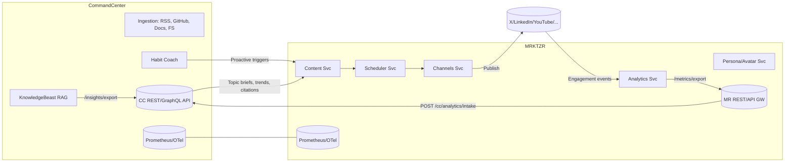

# Integration Architecture (High Level)

```mermaid
flowchart LR
  subgraph CC[CommandCenter]
    CC.Ingest[Ingestion: RSS, GitHub, Docs, FS]
    CC.RAG[KnowledgeBeast RAG]
    CC.Habit[Habit Coach]
    CC.API[(CC REST/GraphQL API)]
    CC.Obs[(Prometheus/OTel)]
  end

  subgraph MR[MRKTZR]
    MR.Content[Content Svc]
    MR.Persona[Persona/Avatar Svc]
    MR.Scheduler[Scheduler Svc]
    MR.Channels[Channels Svc]
    MR.Analytics[Analytics Svc]
    MR.API[(MR REST/API GW)]
    MR.Obs[(Prometheus/OTel)]
  end

  CC.RAG -->|/insights/export| CC.API
  CC.API -->|Topic briefs, trends, citations| MR.Content
  MR.Content --> MR.Scheduler --> MR.Channels
  MR.Channels -->|Publish| Social[(X/LinkedIn/YouTube/...)]
  Social -->|Engagement events| MR.Analytics
  MR.Analytics -->|/metrics/export| MR.API
  MR.API -->|POST /cc/analytics/intake| CC.API
  CC.Habit -->|Proactive triggers| MR.Content
  CC.Obs --- MR.Obs
```
