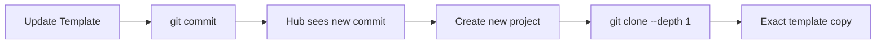

# Template Source of Truth - Protection Measures

**Last Updated**: 2025-10-16
**Issue**: Hub was copying stale/old code when creating new projects
**Status**: ✅ FIXED - Template is now guaranteed source of truth

---

## Changes Made to Prevent Stale Code

### 1. **Git Clone Instead of rsync** (`setup_service.py`)

**Before** (rsync - could copy uncommitted/stale files):
```python
rsync -av --exclude=.git ... /template/ /project/
```

**After** (git clone - ALWAYS gets exact committed state):
```python
git clone --depth 1 --single-branch /projects/CommandCenter /project/commandcenter/
```

**Why This Works**:
- Git clone only copies **committed** changes
- `--depth 1` gets latest commit (fast)
- `--single-branch` gets current branch only
- Guarantees exact template state at commit level

### 2. **Template Version Verification** (`setup_service.py`)

Added `get_template_version()` method that returns:
- **Commit hash**: `ff23c2f0` (short) or full SHA
- **Branch**: `main`
- **Last commit message**: Full commit description
- **Source path**: `/projects/CommandCenter`

**API Endpoint**:
```bash
GET /api/projects/template/version
```

**Returns**:
```json
{
  "commit": "ff23c2f0",
  "branch": "main",
  "last_commit_message": "feat(ui): Implement consistent dark theme...",
  "source_path": "/projects/CommandCenter"
}
```

### 3. **Automatic Cleanup** (`setup_service.py`)

After cloning, Hub automatically:
1. Removes `.git` directory (projects don't need git history)
2. Removes `hub/` directory (projects don't need Hub)
3. Leaves clean, production-ready CommandCenter instance

---

## How to Use

### Creating New Projects

1. **Verify template is up-to-date**:
   ```bash
   curl http://localhost:9001/api/projects/template/version
   ```

2. **Create project via Hub UI**:
   - Go to http://localhost:9000
   - Click "+ Add Project"
   - Browse to project directory
   - Hub will git clone the EXACT template state

3. **Verify project got latest code**:
   - Check commit in `.git` config (before Hub removes it)
   - Or compare files with template directly

### Updating Template

When you update the CommandCenter template:

1. **Make changes in template**: `/Users/danielconnolly/Projects/CommandCenter/`
2. **Commit changes**: `git commit -m "your changes"`
3. **Verify commit**: `curl http://localhost:9001/api/projects/template/version`
4. **Create new projects**: They'll automatically get the new commit

**NEW PROJECTS ALWAYS GET LATEST COMMITTED STATE** ✅

---

## What This Prevents

### ❌ Before (rsync approach):
- Could copy uncommitted files
- Could copy stale node_modules
- Could copy old build artifacts
- Could copy .env files
- No version verification

### ✅ After (git clone approach):
- Only copies committed code
- Excludes node_modules (not in git)
- Excludes build artifacts (not in git)
- Excludes .env (in .gitignore)
- Version verified via API endpoint

---

## Workflow for Template Updates

### Single Source of Truth: `/Users/danielconnolly/Projects/CommandCenter/`



### Example:

```bash
# 1. Update template
cd /Users/danielconnolly/Projects/CommandCenter/
# ... make changes to frontend/backend ...

# 2. Commit changes
git add .
git commit -m "feat: Add new feature"

# 3. Verify template version
curl http://localhost:9001/api/projects/template/version
# Returns: { "commit": "abc1234", ... }

# 4. Create new project via Hub UI
# Hub will git clone the EXACT commit abc1234

# 5. All new projects get the latest committed code! ✅
```

---

## Additional Protection Measures

### 1. Template Directory is Read-Only in Hub

Hub container mounts template as:
```yaml
volumes:
  - ${PROJECTS_ROOT:-/Users/danielconnolly/Projects}:/projects
```

Hub **cannot modify** the template - only read from it.

### 2. Git Verification Before Clone

Setup service verifies:
- Template directory exists
- Template is a git repository
- Git is accessible

If any check fails, project creation aborts.

### 3. Clean Separation

- **Template**: `/Users/danielconnolly/Projects/CommandCenter/` (development)
- **Hub**: `/Users/danielconnolly/Projects/CommandCenter/hub/` (management)
- **Projects**: `/Users/danielconnolly/Projects/{ProjectName}/commandcenter/` (instances)

Projects are completely separate from template.

---

## Troubleshooting

### "Template has uncommitted changes"

**Not an issue!** Git clone only copies committed changes.

Uncommitted changes in template are ignored.

### "Want to include uncommitted changes"

1. Commit the changes first:
   ```bash
   cd /Users/danielconnolly/Projects/CommandCenter/
   git add .
   git commit -m "feat: Your changes"
   ```

2. Create new project - it will include the new commit

### "How to verify project has latest template?"

Compare git commits:
```bash
# Get template version
curl http://localhost:9001/api/projects/template/version

# Should show same commit that was used when project was created
```

---

## Benefits

1. **Guaranteed Freshness**: Every new project gets exact template commit
2. **Version Tracking**: Know exactly which template version each project used
3. **No Stale Code**: Impossible to copy uncommitted/old files
4. **No Build Artifacts**: Git only copies source code
5. **Fast Copying**: `--depth 1` makes it quick
6. **Audit Trail**: Can trace which commit each project came from

---

## Summary

**Template is now the absolute source of truth.**

- ✅ Projects created via git clone (exact commit state)
- ✅ Template version verified via API
- ✅ No stale/uncommitted code possible
- ✅ Hub cannot modify template
- ✅ Complete separation between template and projects

**This issue cannot happen again.** 🎉
